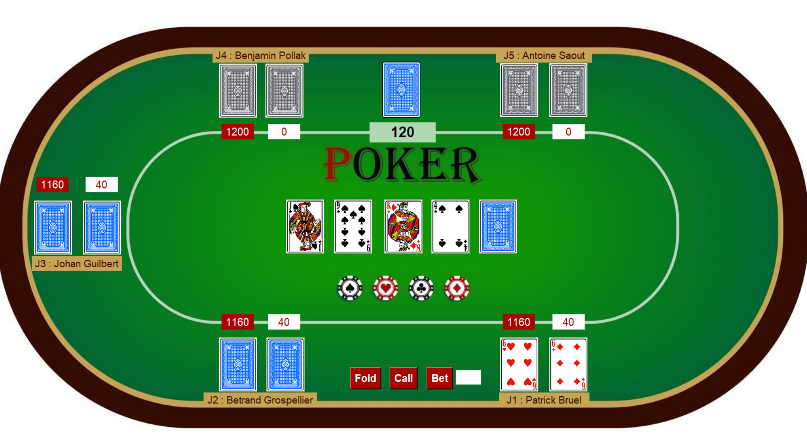
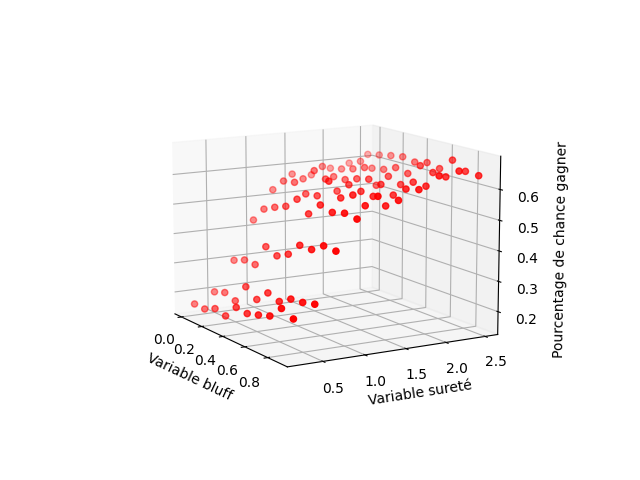

# Poker-algorithme

## Description

The Poker Project is a poker game application developed in Python. It offers a realistic gaming experience with a user-friendly interface and integrated artificial intelligence (AI) to play against virtual opponents.

## Features

- **Integrated AI**: Compete against challenging virtual opponents with our advanced AI that uses algorithms to make strategic decisions.
- **User-Friendly Interface**: An intuitive and aesthetically pleasing interface makes the game easy to navigate for players of all levels.
- **Customization of Settings**: Tailor the game to your preferences with customizable settings like number of player or ai aggresivity
- **Multiplatform Support**: Play on different platforms, including Windows, macOS, and Linux.

## Screenshots





## Installation

1. Clone this repository to your local machine using the following command:
   ```
   git clone https://github.com/natiroir/Poker-algorithme
   ```
2. Navigate to the project directory:
   ```
   cd poker-algorithme
   ```
3. Install dependencies by running:
   ```
   pip install -r requirements.txt
   ```

## Usage

1. Launch the application by running the `main.py` file:
   ```
   python main.py
   ```
2. Select the settings from the txt.
